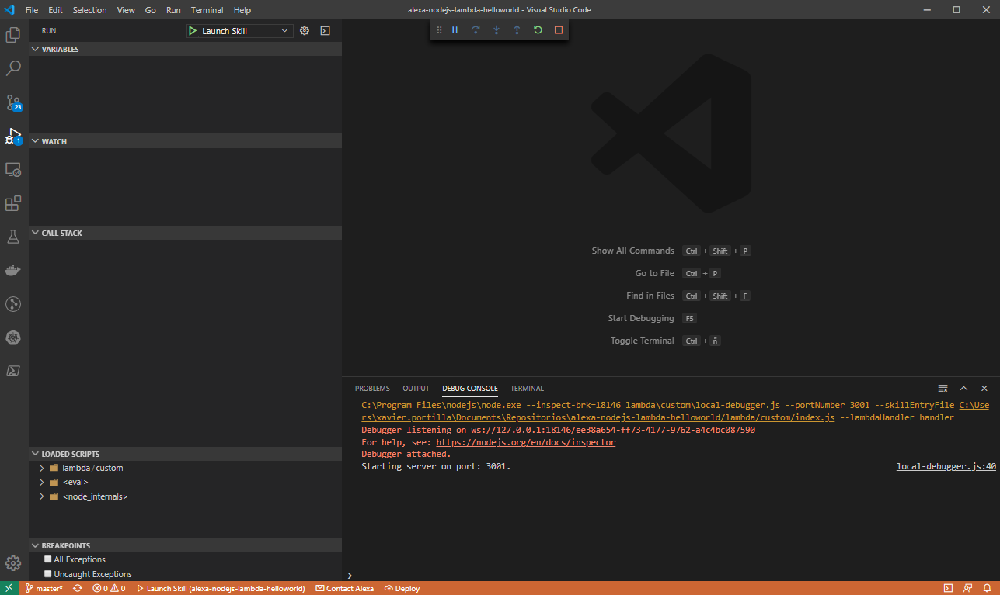
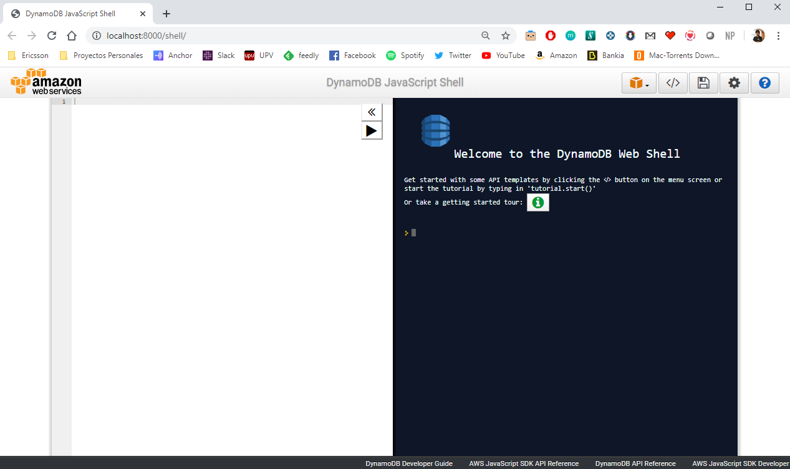
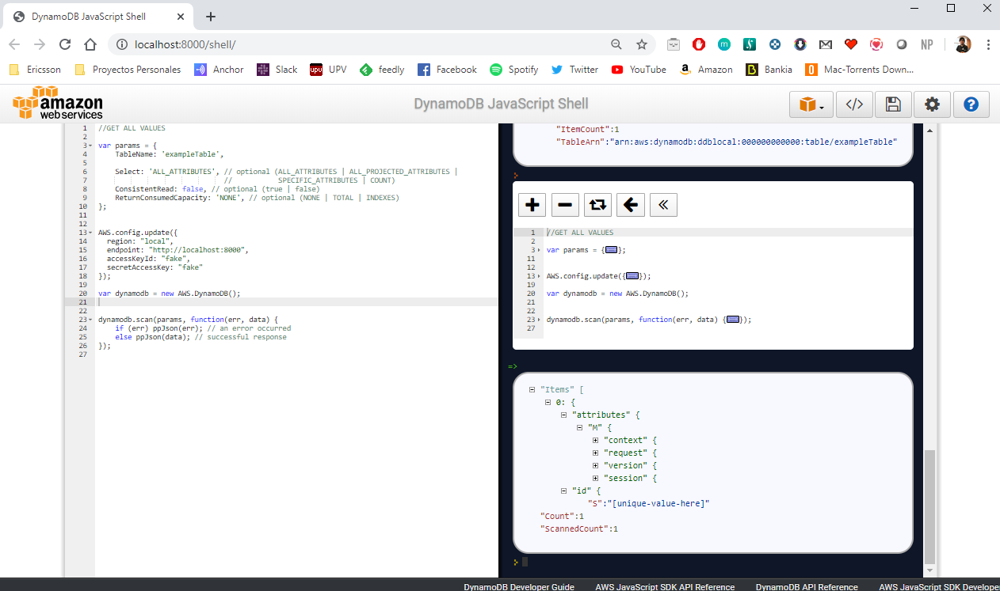
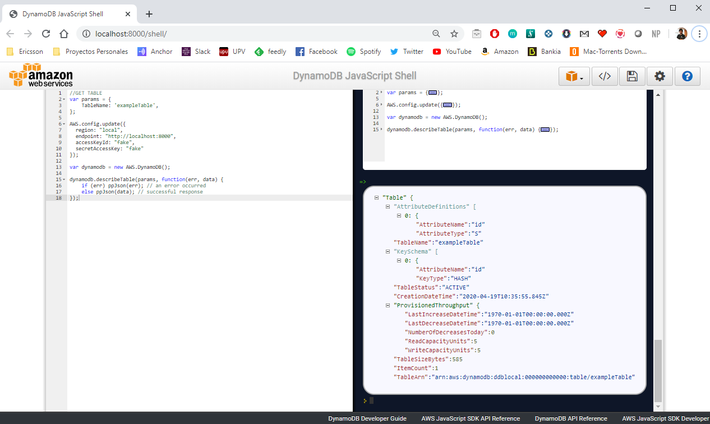

# Externalize your i18n in your Alexa Skill

Mocking away dependencies — especially external dependencies — is common practice when writing tests or when you are developing locally.
Dependency injection typically makes it easy to provide a mock implementation for your dependencies, e.g. a database.

In this article we will discuss how to mocking a [DynamoDB](https://aws.amazon.com/dynamodb/).

Mocking database is a technique that allows you to set the desired database state in your tests to let specific data-sets ready for future test execution. 
Using this technique, you can focus on getting the test data-sets ready once, and then use it on different test phases regarding the environments by using mocking.
This technique is also useful when you are writing your code on your local laptop.
In other words, Database Mocking is a simulation of a database either with few records or with an empty database.

Alexa Skills can use DynamoDB to persist data between sessions. DynamoDB is a fully managed NoSQL database offered by Amazon Web Services.

## Prerequisites

Here you have the technologies used in this project
1. Amazon Developer Account - [How to get it](http://developer.amazon.com/)
2. AWS Account - [Sign up here for free](https://aws.amazon.com/)
3. ASK CLI - [Install and configure ASK CLI](https://developer.amazon.com/es-ES/docs/alexa/smapi/quick-start-alexa-skills-kit-command-line-interface.html)
4. AWS CLI - [Install and configure AWS CLI](https://docs.aws.amazon.com/cli/latest/userguide/cli-chap-install.html)
5. Node.js v10.x
6. Java Runtime Environment (JRE) version 6.x or newer
7. Visual Studio Code
8. npm Package Manager

The Alexa Skills Kit Command Line Interface (ASK CLI) is a tool for you to manage your Alexa skills and related resources, such as AWS Lambda functions.
With ASK CLI, you have access to the Skill Management API, which allows you to manage Alexa skills programmatically from the command line.
If you want how to create your Skill with the ASK CLI, please follow the first step explained in my [Node.js Skill](https://github.com/xavidop/alexa-nodejs-lambda-helloworld) sample. Let's start!

## Creating local DynamoDB

In this project we are going to use the npm package `dynamodb-localhost`. This library works as a wrapper for AWS DynamoDB Local, intended for use in devops. This library is capable of downloading and installing the DynamoDB Local with a simple set of commands, and pass optional attributes defined in [DynamoDB Local Documentation](https://docs.aws.amazon.com/amazondynamodb/latest/developerguide/DynamoDBLocal.html).

If you are using Docker, this npm library executes exactly the same commands but in a different way. The Docker image and this library will run the same [executable jar file](https://docs.aws.amazon.com/amazondynamodb/latest/developerguide/DynamoDBLocal.DownloadingAndRunning.html).

We will use this library in order to make it easier mocking the DynamoDB.

We need to execute these steps in order to run our local DynamoDB.
* The first thing we need is to install this local DynamoDB using the library. This step will be achieved by running the method `dynamodbLocal.install()`. This method will download the latest version of the official jar file that you can find above.
* Once the DynamoDB is installed locally, now we can start it running the method `dynamodbLocal.start(options)`. To run these two steps synchronously we will use the npm package `synchronized-promise`. The `options` object has these properties:
  * **port:** Port to listen on. Default: 8000
  * **cors:**  Enable CORS support (cross-origin resource sharing) for JavaScript. You must provide a comma-separated "allow" list of specific domains. The default setting for cors is an asterisk (*), which allows public access.
  * **inMemory:** DynamoDB; will run in memory, instead of using a database file. When you stop DynamoDB;, none of the data will be saved. Note that you cannot specify both dbPath and inMemory at once. 
  * **dbPath:** The directory where DynamoDB will write its database file. If you do not specify this option, the file will be written to the current directory. Note that you cannot specify both dbPath and inMemory at once. For the path, current working directory is <projectroot>/node_modules/dynamodb-localhost/dynamob. For example to create <projectroot>/node_modules/dynamodb-localhost/dynamob/<mypath> you should specify '<mypath>/' with a forwardslash at the end. 
  * **sharedDb:** DynamoDB will use a single database file, instead of using separate files for each credential and region. If you specify sharedDb, all DynamoDB clients will interact with the same set of tables regardless of their region and credential configuration.
  * **delayTransientStatuses:** Causes DynamoDB to introduce delays for certain operations. DynamoDB can perform some tasks almost instantaneously, such as create/update/delete operations on tables and indexes; however, the actual DynamoDB service requires more time for these tasks. Setting this parameter helps DynamoDB simulate the behavior of the Amazon DynamoDB web service more closely. (Currently, this parameter introduces delays only for global secondary indexes that are in either CREATING or DELETING status.)
  * **optimizeDbBeforeStartup:** Optimizes the underlying database tables before starting up DynamoDB on your computer. You must also specify -dbPath when you use this parameter.
  * **heapInitial:** A string which sets the initial heap size e.g., heapInitial: '2048m'. This is input to the java -Xms argument 
  * **heapMax:**  A string which sets the maximum heap size e.g., heapMax: '1g'. This is input to the java -Xmx argument
* Once we have the DynamoDB running on `http:localhost:8000` we have to create a new DynamoDB client which will connect to this local DynamoDB

So if you want to keep the information between your executions you can set `inMemory` to `false` and additionally, you can specify the `dbPath` where the data will be stored.

This code is located in `utilities/utils.js` file:

```javascript

  function getLocalDynamoDBClient(options) {

        //Javascript Promise used for installing and starting local DynamoDB
        const initializeClient = () => {
            return new Promise((resolve, reject) => {
                dynamodbLocal.install(() => {
                    if (!options) reject(new Error('no options passed in!'))
                    dynamodbLocal.start(options);
                    resolve();
                });    
            })
        };

        //install & start synchronously
        let syncInitialization = sp(initializeClient)
        syncInitialization();

        //configuration for creating a DynamoDB client that will connect to the local instance
        AWS.config.update({
          region: 'local',
          endpoint: 'http://localhost:' + options.port,
          accessKeyId: 'fake',
          secretAccessKey: 'fake',
        });
    
        return new AWS.DynamoDB();
  }

```

## Using local DynamoDB

Now we have our DynamoDB running on our laptop and a client configured ready to connect to it. It is time to set up the Alexa Skill to use this client.
Before this, it is important to notice that a very powerful feature of the new Alexa SDK, is the ability to save session data to DynamoDB with one line of code. 
But in order to activate this feature, you have to tell to the ASK persistence adapter you are going to use and which client will use this adapter.
We need to add the npm package `ask-sdk-dynamodb-persistence-adapter` to create our persistence adapter.

This code is located in `utilities/utils.js` file:

```javascript

  function getPersistenceAdapter(tableName, createTable, dynamoDBClient) {

    let options = {
        tableName: tableName,
        createTable: createTable,
        partitionKeyGenerator: (requestEnvelope) => {
          const userId = Alexa.getUserId(requestEnvelope);
          return userId.substr(userId.lastIndexOf(".") + 1);
        }
    }
    //if a DynamoDB client is specified, this adapter will use it. e.g. the one that will connect to our local instance
    if(dynamoDBClient){
        options.dynamoDBClient = dynamoDBClient
    }

   return new DynamoDbPersistenceAdapter(options);
  }

```
Once we have the local DynamoDB running, the client created, the persistence adapter created and using this client, it is time to set the adapter to our Skill.

This is how our `index.js` looks like:

```javascript

  var local = process.env.DYNAMODB_LOCAL
  let persistenceAdapter;
  //depending if we have enabled the local DynamoDB, we create de persistence adapter with or without local client
  if(local === 'true'){
    let options = { port: 8000 }
    let dynamoDBClient = getLocalDynamoDBClient(options); 
    persistenceAdapter = getPersistenceAdapter("exampleTable", true, dynamoDBClient);
  }else{
    persistenceAdapter = getPersistenceAdapter("exampleTable", true);
  }

  /**
   * This handler acts as the entry point for your skill, routing all request and response
   * payloads to the handlers above. Make sure any new handlers or interceptors you've
   * defined are included below. The order matters - they're processed top to bottom 
   * */
  exports.handler = Alexa.SkillBuilders.custom()
      .addRequestHandlers(
          LaunchRequestHandler,
          HelloWorldIntentHandler,
          HelpIntentHandler,
          CancelAndStopIntentHandler,
          FallbackIntentHandler,
          SessionEndedRequestHandler,
          IntentReflectorHandler)
      .addErrorHandlers(
          ErrorHandler)
      .withPersistenceAdapter(persistenceAdapter)
      .addRequestInterceptors(
          LocalisationRequestInterceptor)
      .addResponseInterceptors(
          SaveAttributesResponseInterceptor)
      .lambda();

```

Finally, we have an example of persisting the data in our `SaveAttributesResponseInterceptor` interceptor located in `interceptors` folder:

```javascript

  const Alexa = require("ask-sdk-core");

  module.exports = {
    SaveAttributesResponseInterceptor: {
      async process(handlerInput, response) {
        if (!response) return; 

        const { attributesManager, requestEnvelope } = handlerInput;

        console.log(
          "Saving to persistent storage:" + JSON.stringify(requestEnvelope)
        );
        attributesManager.setPersistentAttributes(requestEnvelope);
        await attributesManager.savePersistentAttributes();
      },
    },
  };

```

As you can see, the interceptor above is storing in the DynamoDB the incoming request. This is just a silly example used to show you how it works.

## Running the DynamoDB locally with Visual Studio Code

The `launch.json` file in `.vscode` folder has the configuration for Visual Studio Code which allow us to run our lambda locally:

```json

  {
    "version": "0.2.0",
    "configurations": [
          {
              "type": "node",
              "request": "launch",
              "name": "Launch Skill",
              "env": {
                  "DYNAMODB_LOCAL": "true"
              },
              // Specify path to the downloaded local adapter(for nodejs) file
              "program": "${workspaceRoot}/lambda/custom/local-debugger.js",
              "args": [
                  // port number on your local host where the alexa requests will be routed to
                  "--portNumber", "3001",
                  // name of your nodejs main skill file
                  "--skillEntryFile", "${workspaceRoot}/lambda/custom/index.js",
                  // name of your lambda handler
                  "--lambdaHandler", "handler"
              ]
          }
      ]
  }

```
This configuration file will execute the following command:

```bash

  node --inspect-brk=28448 lambda\custom\local-debugger.js --portNumber 3001 --skillEntryFile lambda/custom/index.js --lambdaHandler handler

```

This configuration uses the `local-debugger.js` file which runs a [TCP server](https://nodejs.org/api/net.html) listening on http://localhost:3001

For a new incoming skill request a new socket connection is established.
From the data received on the socket the request body is extracted, parsed into JSON and passed to the skill invoker's lambda handler.
The response from the lambda handler is parsed as a HTTP 200 message format as specified [here](https://developer.amazon.com/docs/custom-skills/request-and-response-json-reference.html#http-header-1)
The response is written onto the socket connection and returned.

After configuring our launch.json file and understanding how the local debugger works, it is time to click on the play button:



After executing it, you can send Alexa POST requests to http://localhost:3001.

**NOTE:** If you want to start the local DynamoDB you have to set to `true` the environment variable `DYNAMODB_LOCAL` in this file.

## Debugging and testing the Skill with Visual Studio Code

Following the steps before, now you can set up breakpoints wherever you want inside all JS files in order to debug your skill. 

In my post talking about [Node.js Skill](https://github.com/xavidop/alexa-nodejs-lambda-helloworld) you can see how to test your Skill either directly with Alexa Developer Console or locally with Postman.

## Checking the local DynamoDB

When we are running the DynamoDB locally, this local instance we will set up a shell in http://localhosta:8000/shell



In that shell we can execute queries in order to check the content of our local database. These are some example of queries you can do:

1. Get all the content of our table:

```javascript

  //GET ALL VALUES FROM TABLE

  var params = {
      TableName: 'exampleTable',

      Select: 'ALL_ATTRIBUTES', // optional (ALL_ATTRIBUTES | ALL_PROJECTED_ATTRIBUTES |
                                //           SPECIFIC_ATTRIBUTES | COUNT)
      ConsistentRead: false, // optional (true | false)
      ReturnConsumedCapacity: 'NONE', // optional (NONE | TOTAL | INDEXES)
  };


  AWS.config.update({
    region: "local",
    endpoint: "http://localhost:8000",
    accessKeyId: "fake",
    secretAccessKey: "fake"
  });

  var dynamodb = new AWS.DynamoDB();


  dynamodb.scan(params, function(err, data) {
      if (err) ppJson(err); // an error occurred
      else ppJson(data); // successful response
  });

```

Then we can show the data of the table:




2. Get the information of our table:

```javascript

  //GET TABLE INFORMATION
  var params = {
      TableName: 'exampleTable',
  };

  AWS.config.update({
    region: "local",
    endpoint: "http://localhost:8000",
    accessKeyId: "fake",
    secretAccessKey: "fake"
  });

  var dynamodb = new AWS.DynamoDB();

  dynamodb.describeTable(params, function(err, data) {
      if (err) ppJson(err); // an error occurred
      else ppJson(data); // successful response
  });

```

Now we can show the information of our table:



These queries are using the [AWS SDK for JavaScript](https://docs.aws.amazon.com/sdk-for-javascript/v2/developer-guide/dynamodb-examples.html). 

This local DynamoDB is accessible by the AWS CLI as well. Before using the CLI, we need to create a `fake` profile that will use the region, accessKeyId and secretAccessKey used by our local database and client. So in our `~/.aws/credentials` we have to create the `fake` profile:

```bash

  [fake]
  aws_access_key_id=fake
  aws_secret_access_key=fake

```

And in our `~/.aws/config` we set the local region for our `fake` profile:

```bash

  [fake]
  region = local

```

After creating it, now we can execute queries using the AWS CLI using our `fake` profile:

```bash

  aws dynamodb list-tables --endpoint-url http://localhost:8000 --region local --profile fake

```

This command will return a list of tables in our local database:

```json

  {
      "TableNames": [
          "exampleTable"
      ]
  }

```

You can find more information about how to make queries with the AWS CLI [here](https://docs.aws.amazon.com/cli/latest/reference/dynamodb/index.html)

## Extra

Of course if you do not want to use the npm package `dynamodb-localhost`, AWS offers to us other ways to run a local instance.
These ways are:
1. Docker image. All info [here](https://hub.docker.com/r/amazon/dynamodb-local).
2. Maven dependency if you have your skill in java using Maven or Gradle. All info [here](https://docs.aws.amazon.com/amazondynamodb/latest/developerguide/DynamoDBLocal.Maven.html)


At the end, those solutions will run exactly the same as npm package `dynamodb-localhost` but in some different ways. Choose the one that fits you better!


## Conclusion 

This was a basic tutorial to mock a DynamoDB with our Alexa Skills using Node.js.
With this technique, you can easily make changes to your unit test data and run experiments. This is will make your tests more believable with "real" data and a "real" environment.

How many of you have had an issue with production where it works on staging, but doesn't work on production and the source code is the same in both environments.

This is one example of being able to take/save data from/to a local DynamoDB (with the query above) run it to find out issues, how it works, etc.

In the long run, this makes your unit tests even more valuable to you.

I hope this example project is useful to you.

That's all folks!

Happy coding!
