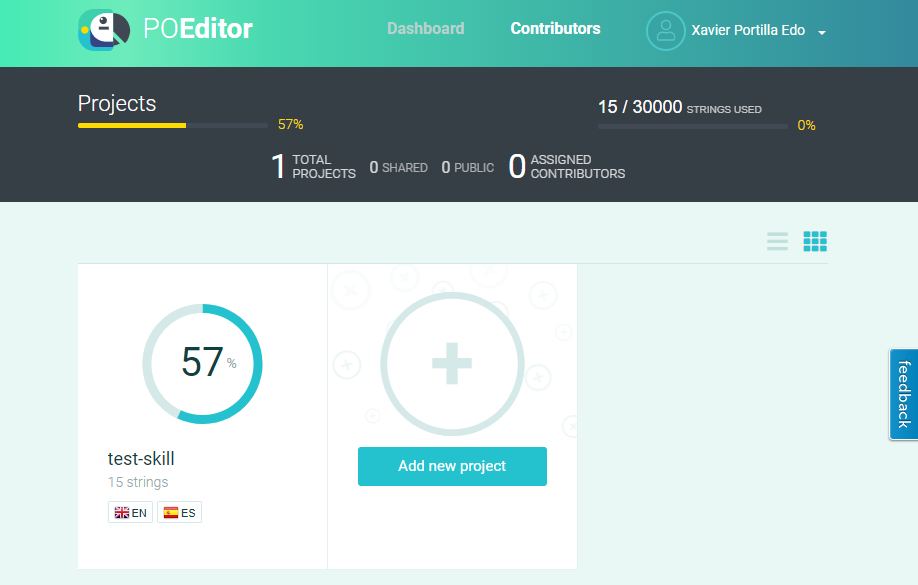
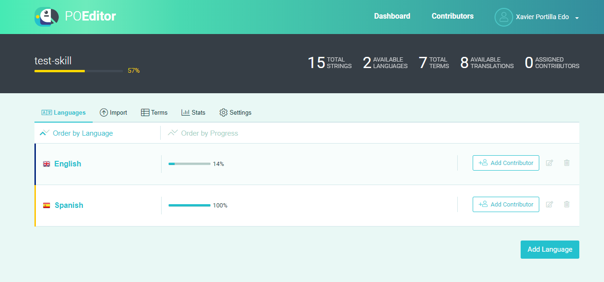
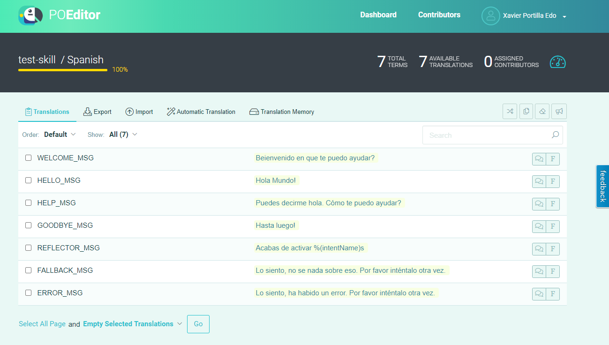
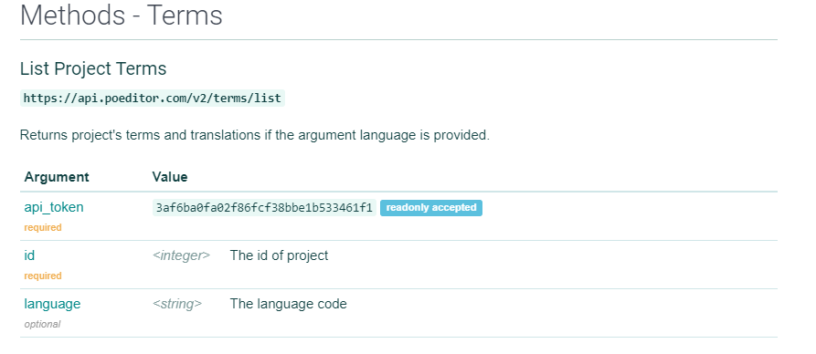
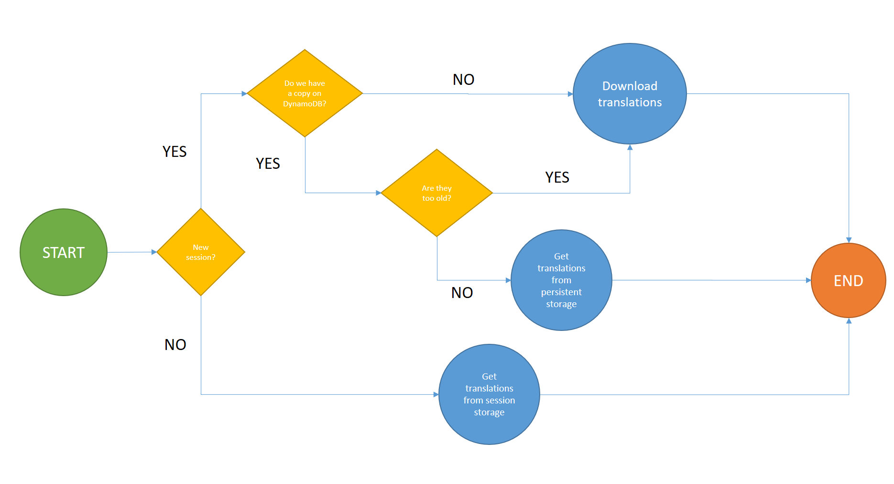
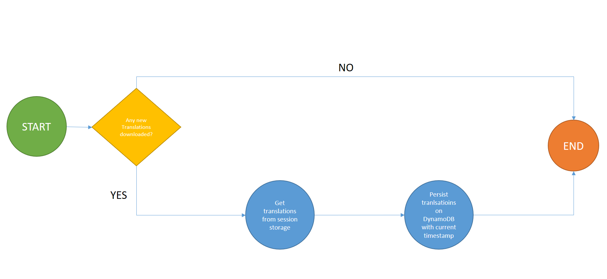

# Externalize your i18n in your Alexa Skill

In computing, internationalization is the process of designing software so that it can be adapted to different languages and regions without the need of re-engineering or making changes in code.

In the case of software, it means to translate into several languages, using different currencies or using different date formats.

In terms of Alexa Skills, it is a good practice having the translations separated from the AWS Lambda source code.
There are many tools that can help us in this process. 
We will guide you in this process using POEditor.

## Prerequisites

Here you have the technologies used in this project

1. Amazon Developer Account - [How to get it](http://developer.amazon.com/)
2. AWS Account - [Sign up here for free](https://aws.amazon.com/)
3. ASK CLI - [Install and configure ASK CLI](https://developer.amazon.com/es-ES/docs/alexa/smapi/quick-start-alexa-skills-kit-command-line-interface.html)
4. AWS CLI - [Install and configure AWS CLI](https://docs.aws.amazon.com/cli/latest/userguide/cli-chap-install.html)
5. POEditor Account - [Register here](https://poeditor.com/)
6. Node.js v10.x
7. Java Runtime Environment (JRE) version 6.x or newer
8. Visual Studio Code
9. npm Package Manager

The Alexa Skills Kit Command Line Interface (ASK CLI) is a tool for you to manage your Alexa skills and related resources, such as AWS Lambda functions.
With ASK CLI, you have access to the Skill Management API, which allows you to manage Alexa skills programmatically from the command line.
If you want how to create your Skill with the ASK CLI in Node.js using DynamoDB on local machine, please follow the steps explained in my repository [here](https://github.com/xavidop/alexa-nodejs-dynamo-local) sample. Let's start!

## POEditor

POEditor is an online localization platform and translation management system, designed for teams to collaborate easily, but also suited for individuals. You can use POEditor to translate apps, websites, themes, plugins, games or other software products, and to automate the localization workflow. Supported most of the l18n file formats. They also have a really nice and easy-to-use [RESTFul API](https://poeditor.com/docs/api).

What POEditor offer to us?

1. **Simple REST API**
   Bring POEditor to home base by connecting it to your software via our simple API. Let the API automate your localization workflow and forget about manually managing your localization projects.
2. **GitHub, Bitbucket, GitLab and Azure DevOps integration**
   Connect your repos to your POEditor account to quickly communicate data between our localization platform and GitHub/Bitbucket/GitLab/Azure Devops. Use the WordPress translation plugin to manage the localization of your language files directly in WordPress, via the POEditor API.
3. **Slack and Microsoft Teams integration**
   Connect your POEditor account to Slack or Microsoft Teams and never miss any important events during the localization process. Add your localization team members to dedicated channels, and you'll always be on the same page, in real time.
4. **Crowdsourced translation projects**
   Set your software localization project to "Public" to crowdsource the translation of your strings. You will get a link that you can share in order to invite people to enroll as contributors.
5. **Rich statistics**
   The stats page offers real-time information about your translators' activity, the amount of terms, translations, words and characters belonging to a localization project, as well as charts and the percentage of completion for each language
6. **Smart Translation Memory**
   Don't like to translate strings multiple times? Then you will enjoy using the Translation Memory feature. The TM searches through all your previous translations so you can reuse them.
7. **Realtime translation updates**
   If collaborative software localization sounds like a mess, relax. POEditor lets you know of your fellow translators' whereabouts when you're sharing the same language page, and automatically saves any changes you make to the translation.
8. **Human translation services**
   Purchase professional human translations for your localization project directly from your POEditor account. We've neatly aggregated the translation providers we are partners with, for you to easily compare and integrate into your continuous localization workflow.
9. **Automatic Translation**
   Automatic Translation offers the possibility to work with the machine translation engines from Google, Microsoft and DeepL, in order to automatically fill in missing translations.

## Setting up POEditor

Once we haven sign up on POEditor, now it is time to create a new project for our Alexa Skill. It is a good practice to have one POEditor project per Skill.

We have created one called `test-skill` that contains 15 strings and it is available in Spanish and English:



As you can see above, we have a quick look at the status of our projects. We can see we have the 57% of our project translated.

If we click on our project, we will see the status of that project:



In this view we can see we have 15 strings in 2 languages with 7 terms to translate and only 8 available translations. Below this it is available the information per language, we have all the Spanish translations but in English we only have the 14%, it means that in English we only have one translation done.

In this page you can make a bulk import, add terms to translate, add new languages, show the stats of the translations and setting up some configuration of this project like permissions, contributors, code hosting service integration, make it open source, etc.

And finally if we click in a language, e.g. Spanish, we will see the translations:



Here you can make a bulk import as well, export the current language translations and execute the translation memory tool. If you do not have all the translation of this language you can activate the automatic translation (It will use Google, Microsoft or DeepL to make that).

## Downloading translations in the Alexa Skill

So, now we have the project properly configured. To download the translations, we will use the POEditor API to download the terms and all translations of one specific language:



This is an example of the request:

```bash
  curl -X POST https://api.poeditor.com/v2/terms/list \
      -d api_token="3af6ba0fa02f86fcf38bbe1b533461f1" \
      -d id="7717" \
      -d language="es"
```

This is an example of the response:

```json
  {
    "response": {
      "status": "success",
      "code": "200",
      "message": "OK"
    },
    "result": {
      "terms": [
        {
          "term": "WELCOME_MSG",
          "context": "",
          "plural": "",
          "created": "2020-05-16T16:53:24+0000",
          "updated": "2020-05-24T11:45:59+0000",
          "translation": {
            "content": "Beienvenido en que te puedo ayudar?",
            "fuzzy": 0,
            "updated": "2020-05-24T12:12:21+0000"
          },
          "reference": "",
          "tags": [],
          "comment": ""
        },
        {
          "term": "HELLO_MSG",
          "context": "",
          "plural": "",
          "created": "2020-05-24T11:31:07+0000",
          "updated": "",
          "translation": {
            "content": "Hola Mundo!",
            "fuzzy": 0,
            "updated": "2020-05-24T11:32:13+0000"
          },
          "reference": "",
          "tags": [],
          "comment": ""
        },
        {
          "term": "HELP_MSG",
          "context": "",
          "plural": "",
          "created": "2020-05-24T11:31:20+0000",
          "updated": "",
          "translation": {
            "content": "Puedes decirme hola. Cómo te puedo ayudar?",
            "fuzzy": 0,
            "updated": "2020-05-24T11:32:19+0000"
          },
          "reference": "",
          "tags": [],
          "comment": ""
        },
        {
          "term": "GOODBYE_MSG",
          "context": "",
          "plural": "",
          "created": "2020-05-24T11:31:25+0000",
          "updated": "",
          "translation": {
            "content": "Hasta luego!",
            "fuzzy": 0,
            "updated": "2020-05-24T11:32:23+0000"
          },
          "reference": "",
          "tags": [],
          "comment": ""
        },
        {
          "term": "REFLECTOR_MSG",
          "context": "",
          "plural": "",
          "created": "2020-05-24T11:31:29+0000",
          "updated": "",
          "translation": {
            "content": "Acabas de activar %(intentName)s",
            "fuzzy": 0,
            "updated": "2020-05-24T12:12:26+0000"
          },
          "reference": "",
          "tags": [],
          "comment": ""
        },
        {
          "term": "FALLBACK_MSG",
          "context": "",
          "plural": "",
          "created": "2020-05-24T11:31:34+0000",
          "updated": "",
          "translation": {
            "content": "Lo siento, no se nada sobre eso. Por favor inténtalo otra vez.",
            "fuzzy": 0,
            "updated": "2020-05-24T11:32:34+0000"
          },
          "reference": "",
          "tags": [],
          "comment": ""
        },
        {
          "term": "ERROR_MSG",
          "context": "",
          "plural": "",
          "created": "2020-05-24T11:31:38+0000",
          "updated": "",
          "translation": {
            "content": "Lo siento, ha habido un error. Por favor inténtalo otra vez.",
            "fuzzy": 0,
            "updated": "2020-05-24T11:32:38+0000"
          },
          "reference": "",
          "tags": [],
          "comment": ""
        }
      ]
    }
  }

```
Understanding how the API works, it is time to integrate it into our Alexa Skill.

We will use the following flow to download the translations:



The following code located in `utilities/i18nUtils.js` will execute the same as we explained in the flow diagram:

```javascript

  async function downloadTranslations(locale, handlerInput) {

        const ISOlocale = locale.split('-')[0];
        const { attributesManager } = handlerInput;
        var sessionAtrributes = attributesManager.getSessionAttributes();
        var download = false;
        //New session stablished
        if(!('translations' in sessionAtrributes)){
            console.log('NO TRANSLATIONS IN SESSION');
            persitentAttributes = await attributesManager.getPersistentAttributes();
            if(!('translations' in persitentAttributes)){
                console.log('NO TRANSLATIONS IN DYNAMODB');
                download = true;
            
            }else{
                //we have translataions
                if((ISOlocale in persitentAttributes.translations)){
                        const lastDowloaded = moment(persitentAttributes.translations[ISOlocale].timestamp);
                        const today = moment();

                        var diffDays = today.diff(lastDowloaded, 'days');
                        if(diffDays >= 7){
                            console.log('THERE ARE TRANSLATIONS IN DYNAMODB FOR CURRENT LOCALE BUT TO OLD');
                            download = true;
                        }else{
                            console.log('THERE ARE TRANSLATIONS IN DYNAMODB FOR CURRENT LOCALE');
                            download = false;
                            translations = persitentAttributes.translations[ISOlocale].strings;
                        }
                        
                }else{
                    console.log('THERE ARE TRANSLATIONS IN DYNAMODB BUT NOT FOR CURRENT LOCALE');
                    download = true
                }
            }
        }

        if(download){
            console.log('DOWNLOADING TRANSLATIONS...');
            translations = await rp.post(poEditorEndpoint, {
                form: {
                    api_token: poEditorToken,
                    id: poEditorProjectId,
                    language: ISOlocale
                }
            }).then(function (body) {
                // Request succeeded but might as well be a 404
                // Usually combined with resolveWithFullResponse = true to check response.statusCode
                return JSON.parse(body).result;
                
            })
            .catch(function (err) {
                // Request failed due to technical reasons...
            });
        }

        
        sessionAtrributes['translations'] = translations;
        sessionAtrributes['translations'].downloaded = download;
        console.log('TRANSLATIONS: ' + JSON.stringify(translations));

        attributesManager.setSessionAttributes(sessionAtrributes);

    }

```

In order to make in an easy way a `x-www-form-urlencoded` POST request in Node.js, we will use the npm package `request-promise`.

This code will be called from the `localisationRequestInterceptor`:

```javascript

const Alexa = require('ask-sdk-core');

const i18nUtils = require('../utilities/i18nUtils');

// This request interceptor will bind a translation function 't' to the handlerInput
module.exports = {
    LocalisationRequestInterceptor: {
        async process(handlerInput) {

            const locale = Alexa.getLocale(handlerInput.requestEnvelope);
            await i18nUtils.downloadTranslations(locale, handlerInput);

        }
    }
}
```

## Using translations in the Alexa Skill

Now we have the translations downloaded in our Alexa Skill, it is time to use it there!

I have removed the `i18next` npm package because we will not use it any more. Now we will have our own translation function.

This function will be search a term in the translations downloaded before. It is located in `i18nUtils.js` as well:

```javascript

  function getTranslation(key, handlerInput, replaceObjects) {

        const { attributesManager } = handlerInput;
        const sessionAtributes = attributesManager.getSessionAttributes();
        const terms = sessionAtributes['translations'].terms;

        for(var i = 0; i < terms.length; i++){
            t = terms[i];
            if(t.term === key){
                return sprintfJs.sprintf(t.translation.content, replaceObjects);
            }
        }

    }

```

Now we can call this function wherever we want in our Alexa Skill:

```javascript
  const Alexa = require('ask-sdk-core');
  const i18nUtils = require('../utilities/i18nUtils');

  module.exports = {
      LaunchRequestHandler: {
          canHandle(handlerInput) {
              return Alexa.getRequestType(handlerInput.requestEnvelope) === 'LaunchRequest';
          },
          handle(handlerInput) {
              const speakOutput = i18nUtils.getTranslation('WELCOME_MSG', handlerInput);
              
              return handlerInput.responseBuilder
                  .speak(speakOutput)
                  .reprompt(speakOutput)
                  .getResponse();
          }
      }
  };

```

This function supports string replacement like the `i18next` package. In this case, I am using the npm package `sprintf-js`:

```javascript
  const Alexa = require('ask-sdk-core');
  const i18nUtils = require('../utilities/i18nUtils');

  /* *
  * The intent reflector is used for interaction model testing and debugging.
  * It will simply repeat the intent the user said. You can create custom handlers for your intents 
  * by defining them above, then also adding them to the request handler chain below 
  * */
  module.exports = {
      IntentReflectorHandler: {
          canHandle(handlerInput) {
              return Alexa.getRequestType(handlerInput.requestEnvelope) === 'IntentRequest';
          },
          handle(handlerInput) {
            
              const intentName = Alexa.getIntentName(handlerInput.requestEnvelope);
            
              const speakOutput = i18nUtils.getTranslation('REFLECTOR_MSG', handlerInput, {intentName: intentName});

              return handlerInput.responseBuilder
                  .speak(speakOutput)
                  //.reprompt('add a reprompt if you want to keep the session open for the user to respond')
                  .getResponse();
          }
      }
  };
```

## Saving translations in the Alexa Skill

In order to not to download the translations every time we run the Skill, we will persist them to DynamoDB following this flow:



This flow is implemented on the `saveAttributesResponseInterceptor` intercetpor:

```javascript
  const Alexa = require('ask-sdk-core');
  var moment = require('moment');

  // This request interceptor will bind a translation function 't' to the handlerInput
  module.exports = {
    SaveAttributesResponseInterceptor: {
      async process(handlerInput, response) {
        
        if (!response) return; // avoid intercepting calls that have no outgoing response due to errors
        const { attributesManager, requestEnvelope } = handlerInput;
        const sessionAtributes = attributesManager.getSessionAttributes();
        const translations = sessionAtributes['translations'];
        const downloaded = sessionAtributes['translations'].downloaded;

          if (downloaded) {

            persitentAttributes = await attributesManager.getPersistentAttributes();

            
            const locale = Alexa.getLocale(requestEnvelope);
            const ISOlocale = locale.split('-')[0];
            const timestamp = moment().toISOString();

            if (!('translations' in persitentAttributes)
                || (('translations' in persitentAttributes) && !(ISOlocale in persitentAttributes.translations))) {

              var saveObject = {};
              
              saveObject[ISOlocale] = {
                timestamp: timestamp,
                strings: translations,
              };
              persitentAttributes['translations'] = saveObject;

            } else {
                //Set values
                persitentAttributes.translations[ISOlocale].timestamp = timestamp;
                persitentAttributes.translations[ISOlocale].strings = translations;
            }
            
            console.log(
              'Saving to persistent storage:' + JSON.stringify(persitentAttributes)
            );
            //Persist values
            attributesManager.setPersistentAttributes(persitentAttributes);

            await attributesManager.savePersistentAttributes();
          }
      },
    },
  };


```


## Running the Skill and DynamoDB locally with Visual Studio Code

The `launch.json` file in `.vscode` folder has the configuration for Visual Studio Code which allow us to run our lambda locally:

```json
{
  "version": "0.2.0",
  "configurations": [
    {
      "type": "node",
      "request": "launch",
      "name": "Launch Skill",
      "env": {
        "DYNAMODB_LOCAL": "true"
      },
      // Specify path to the downloaded local adapter(for nodejs) file
      "program": "${workspaceRoot}/lambda/custom/local-debugger.js",
      "args": [
        // port number on your local host where the alexa requests will be routed to
        "--portNumber",
        "3001",
        // name of your nodejs main skill file
        "--skillEntryFile",
        "${workspaceRoot}/lambda/custom/index.js",
        // name of your lambda handler
        "--lambdaHandler",
        "handler"
      ]
    }
  ]
}
```

This configuration file will execute the following command:

```bash

  node --inspect-brk=28448 lambda\custom\local-debugger.js --portNumber 3001 --skillEntryFile lambda/custom/index.js --lambdaHandler handler

```

This configuration uses the `local-debugger.js` file which runs a [TCP server](https://nodejs.org/api/net.html) listening on http://localhost:3001

For a new incoming skill request a new socket connection is established.
From the data received on the socket the request body is extracted, parsed into JSON and passed to the skill invoker's lambda handler.
The response from the lambda handler is parsed as a HTTP 200 message format as specified [here](https://developer.amazon.com/docs/custom-skills/request-and-response-json-reference.html#http-header-1)
The response is written onto the socket connection and returned.

After configuring our launch.json file and understanding how the local debugger works, it is time to click on the play button:


After executing it, you can send Alexa POST requests to http://localhost:3001.

**NOTE:** If you want to start the local DynamoDB you have to set to `true` the environment variable `DYNAMODB_LOCAL` in this file.

## Debugging and testing the Skill with Visual Studio Code

Following the steps before, now you can set up breakpoints wherever you want inside all JS files in order to debug your skill.

In my post talking about [Node.js Skill](https://github.com/xavidop/alexa-nodejs-lambda-helloworld) you can see how to test your Skill either directly with Alexa Developer Console or locally with Postman.

## Checking the local DynamoDB

When we are running the DynamoDB locally, this local instance we will set up a shell in http://localhosta:8000/shell


In that shell we can execute queries in order to check the content of our local database. These are some example of queries you can do:

1. Get all the content of our table:

```javascript
//GET ALL VALUES FROM TABLE

var params = {
  TableName: "exampleTable",

  Select: "ALL_ATTRIBUTES", // optional (ALL_ATTRIBUTES | ALL_PROJECTED_ATTRIBUTES |
  //           SPECIFIC_ATTRIBUTES | COUNT)
  ConsistentRead: false, // optional (true | false)
  ReturnConsumedCapacity: "NONE", // optional (NONE | TOTAL | INDEXES)
};

AWS.config.update({
  region: "local",
  endpoint: "http://localhost:8000",
  accessKeyId: "fake",
  secretAccessKey: "fake",
});

var dynamodb = new AWS.DynamoDB();

dynamodb.scan(params, function (err, data) {
  if (err) ppJson(err);
  // an error occurred
  else ppJson(data); // successful response
});
```

Then we can show the data of the table:


2. Get the information of our table:

```javascript
//GET TABLE INFORMATION
var params = {
  TableName: "exampleTable",
};

AWS.config.update({
  region: "local",
  endpoint: "http://localhost:8000",
  accessKeyId: "fake",
  secretAccessKey: "fake",
});

var dynamodb = new AWS.DynamoDB();

dynamodb.describeTable(params, function (err, data) {
  if (err) ppJson(err);
  // an error occurred
  else ppJson(data); // successful response
});
```

Now we can show the information of our table:


These queries are using the [AWS SDK for JavaScript](https://docs.aws.amazon.com/sdk-for-javascript/v2/developer-guide/dynamodb-examples.html).

This local DynamoDB is accessible by the AWS CLI as well. Before using the CLI, we need to create a `fake` profile that will use the region, accessKeyId and secretAccessKey used by our local database and client. So in our `~/.aws/credentials` we have to create the `fake` profile:

```bash

  [fake]
  aws_access_key_id=fake
  aws_secret_access_key=fake

```

And in our `~/.aws/config` we set the local region for our `fake` profile:

```bash

  [fake]
  region = local

```

After creating it, now we can execute queries using the AWS CLI using our `fake` profile:

```bash

  aws dynamodb list-tables --endpoint-url http://localhost:8000 --region local --profile fake

```

This command will return a list of tables in our local database:

```json
{
  "TableNames": ["exampleTable"]
}
```

You can find more information about how to make queries with the AWS CLI [here](https://docs.aws.amazon.com/cli/latest/reference/dynamodb/index.html)

## Conclusion

Internationalization takes place as a fundamental step in the design and development process, rather than as a subsequent addition, which can often involve a difficult and expensive process of reengineering. We have to take the correct decision in terms of i18n in the beginning of our development process.

I hope this example project is useful to you.

That's all folks!

Happy coding!
